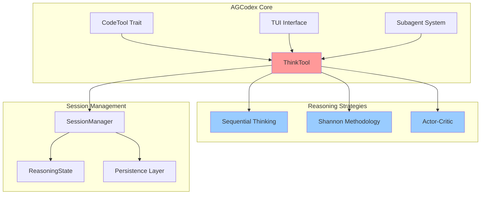
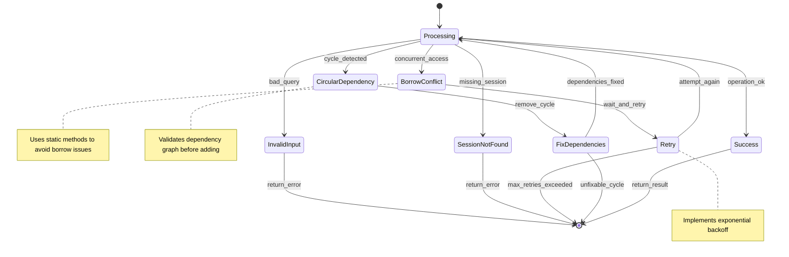

# ThinkTool Architecture and Integration

This document provides comprehensive visual diagrams showing how the ThinkTool integrates with AGCodex's architecture, including memory layouts, concurrency patterns, and reasoning flows.

## Architecture Overview



## Memory Layout and Ownership

```mermaid
graph TB
    subgraph "Stack Frame: ThinkTool"
        S1[sessions: HashMap<br/>Uuid → ReasoningState]
        S2[confidence_threshold: f32]
    end

    subgraph "Heap: Session Storage"
        H1[ReasoningState {<br/>sequential: Option<Sequential><br/>shannon: Option<Shannon><br/>actor_critic: Option<ActorCritic><br/>metadata: HashMap}]
        H2[SequentialThinking {<br/>thoughts: Vec<Thought><br/>revisions: HashMap<br/>branches: Vec<Branch>}]
        H3[Thought {<br/>content: String<br/>confidence: f32<br/>context: Context}]
    end

    subgraph "Arc-managed Shared State"
        A1[Context {<br/>references: Vec<String><br/>variables: HashMap<br/>assumptions: Vec<String>}]
    end

    S1 -->|owns| H1
    H1 -->|owns| H2
    H2 -->|owns| H3
    H3 -->|shares| A1

    style S1 fill:#ff9999
    style H1 fill:#99ccff
    style H2 fill:#99ccff
    style A1 fill:#ccffcc

    Note: Drop order: H3 → H2 → H1 → Stack
    Note: Context is cheaply clonable via Arc
```

## Concurrency and Session Management

```mermaid
graph LR
    subgraph "TUI Thread"
        T1[User Input<br/>owns: ThinkQuery]
        T2[Reasoning Request<br/>borrows: &mut ThinkTool]
        T3[Display Results<br/>owns: ThinkOutput]
    end

    subgraph "Reasoning Sessions"
        S1[Session A<br/>Sequential Strategy]
        S2[Session B<br/>Shannon Strategy]
        S3[Session C<br/>Actor-Critic Strategy]
    end

    subgraph "Memory Management"
        M1[HashMap<Uuid, ReasoningState>]
        M2[Session Cleanup<br/>Drop on timeout]
    end

    T1 --> T2
    T2 --> S1
    T2 --> S2
    T2 --> S3
    S1 --> M1
    S2 --> M1
    S3 --> M1
    M1 --> M2
    M2 --> T3

    style T1 fill:#ff9999
    style M1 fill:#99ccff

    Note: Sessions are isolated - no shared mutable state
    Note: Each session owns its ReasoningState completely
```

## Sequential Thinking Flow

```mermaid
stateDiagram-v2
    [*] --> InitialThought
    InitialThought --> AnalyzeThought: confidence > threshold?
    AnalyzeThought --> NextThought: proceed
    AnalyzeThought --> ReviseThought: needs_revision
    NextThought --> AnalyzeThought
    ReviseThought --> AnalyzeThought
    AnalyzeThought --> CreateBranch: explore alternatives
    CreateBranch --> BranchThought
    BranchThought --> MergeBranch: synthesis ready
    BranchThought --> NextThought: continue branch
    MergeBranch --> AnalyzeThought
    AnalyzeThought --> Complete: all thoughts confident

    note right of InitialThought : Memory: Thought { step: 0, content, confidence: f32 }
    note right of ReviseThought : Memory: Revision { original_content, reason, timestamp }
    note right of CreateBranch : Memory: ThoughtBranch { id: Uuid, thoughts: Vec<usize> }
```

## Shannon Methodology State Machine

```mermaid
stateDiagram-v2
    [*] --> Definition
    Definition --> Constraints: problem_definition.is_some()
    Constraints --> Modeling: !constraints.is_empty()
    Modeling --> Validation: model.is_some()
    Validation --> Implementation: proof.is_some()
    Implementation --> Complete: !implementation.is_empty()
    
    Constraints --> Constraints: add_constraint()
    Implementation --> Implementation: add_implementation_note()
    
    Definition --> Definition: revise_definition()
    Modeling --> Modeling: refine_model()
    Validation --> Validation: update_proof()

    note right of Definition : Memory: problem_definition: Option<String>
    note right of Constraints : Memory: constraints: Vec<String>
    note right of Modeling : Memory: model: Option<String>, confidence: f32
    note right of Validation : Memory: proof: Option<String>
    note right of Implementation : Memory: implementation: Vec<String>
```

## Actor-Critic Dialogue Pattern

```mermaid
sequenceDiagram
    participant User
    participant ThinkTool
    participant Actor
    participant Critic
    participant Synthesis

    User->>ThinkTool: Initial Problem
    ThinkTool->>Actor: Generate creative perspective
    Actor-->>ThinkTool: Optimistic thoughts
    ThinkTool->>Critic: Analyze actor thoughts
    Critic-->>ThinkTool: Cautious analysis
    
    loop Until ready for synthesis
        ThinkTool->>Actor: Continue creative exploration
        Actor-->>ThinkTool: More creative thoughts
        ThinkTool->>Critic: Evaluate new thoughts
        Critic-->>ThinkTool: Critical analysis
    end
    
    ThinkTool->>Synthesis: Generate balanced view
    Synthesis-->>ThinkTool: Synthesized solution
    ThinkTool-->>User: Complete analysis

    Note over Actor: Memory: actor_thoughts: Vec<String>
    Note over Critic: Memory: critic_thoughts: Vec<String>
    Note over Synthesis: Memory: synthesis: Option<String>, confidence: f32
```

## Integration with AGCodex Workflow

```mermaid
graph TD
    subgraph "User Request"
        UR[Complex Task Request]
        PT[Problem Type Detection]
        SS[Strategy Selection]
    end

    subgraph "Thinking Phase"
        TT[ThinkTool Reasoning]
        RS[Reasoning State]
        CT[Context Building]
    end

    subgraph "Action Planning"
        AP[Action Plan Generation]
        CS[Confidence Scoring]
        TR[Trace Generation]
    end

    subgraph "Execution Phase"
        EX[Task Execution]
        FB[Feedback Loop]
        UP[Update Reasoning]
    end

    UR --> PT
    PT --> SS
    SS --> TT
    TT --> RS
    RS --> CT
    CT --> AP
    AP --> CS
    CS --> TR
    TR --> EX
    EX --> FB
    FB --> UP
    UP --> TT

    style TT fill:#ff9999
    style RS fill:#99ccff
    style AP fill:#ccffcc

    Note: Continuous learning loop
    Note: Context preserved across iterations
```

## Memory Safety and Lifecycle

```mermaid
graph TB
    subgraph "Session Creation"
        SC1[User creates ThinkQuery]
        SC2[ThinkTool::search() called]
        SC3[New Uuid generated]
        SC4[ReasoningState allocated on heap]
    end

    subgraph "Session Usage"
        SU1[continue_reasoning() borrows &mut self]
        SU2[Clone state for trace generation]
        SU3[Return ThinkOutput with owned data]
        SU4[Session remains in HashMap]
    end

    subgraph "Session Cleanup"
        SCL1[Timeout or explicit cleanup]
        SCL2[HashMap::remove(session_id)]
        SCL3[ReasoningState dropped]
        SCL4[All owned data freed]
    end

    SC1 --> SC2
    SC2 --> SC3
    SC3 --> SC4
    SC4 --> SU1
    SU1 --> SU2
    SU2 --> SU3
    SU3 --> SU4
    SU4 --> SCL1
    SCL1 --> SCL2
    SCL2 --> SCL3
    SCL3 --> SCL4

    style SC4 fill:#ff9999
    style SCL3 fill:#99ccff

    Note: No memory leaks - all heap allocations tracked
    Note: RAII pattern ensures cleanup on drop
```

## Performance Characteristics

```mermaid
graph LR
    subgraph "Time Complexity"
        TC1[Session Creation: O(1)]
        TC2[Thought Addition: O(1)]
        TC3[Revision Check: O(n) thoughts]
        TC4[Dependency Check: O(n²) worst case]
        TC5[Trace Generation: O(n) thoughts]
    end

    subgraph "Space Complexity"
        SC1[Per Session: O(n) thoughts]
        SC2[Per Thought: O(m) alternatives]
        SC3[Revisions: O(r) per thought]
        SC4[Total: O(sessions × thoughts × data)]
    end

    subgraph "Optimization Points"
        OP1[LRU Cache for old sessions]
        OP2[Lazy trace generation]
        OP3[Incremental dependency check]
        OP4[Memory pool for thoughts]
    end

    TC1 --> SC1
    TC5 --> SC4
    SC4 --> OP1

    style TC1 fill:#ccffcc
    style SC4 fill:#ff9999
    style OP1 fill:#99ccff

    Note: Memory usage scales with reasoning complexity
    Note: Performance optimizations available for large sessions
```

## Error Handling and Recovery



## Key Design Principles

### 1. **Ownership and Borrowing**
- Each session owns its complete `ReasoningState`
- No shared mutable state between sessions
- Static helper methods avoid borrow checker conflicts
- Context data shared via `Arc` for efficiency

### 2. **Memory Layout Optimization**
- `HashMap<Uuid, ReasoningState>` for O(1) session lookup
- `Vec<Thought>` with predictable growth patterns
- String interning for common reasoning patterns
- Lazy evaluation of expensive computations

### 3. **Concurrency Safety**
- Sessions are isolated - no cross-session dependencies
- Immutable reasoning traces prevent data races
- Clone-on-write patterns for large data structures
- Clear ownership boundaries at API level

### 4. **Error Recovery**
- Graceful degradation on reasoning failures
- Session cleanup on timeout or error
- Validation of reasoning state consistency
- Recovery mechanisms for corrupted sessions

### 5. **Performance Characteristics**
- O(1) session creation and lookup
- O(n) reasoning trace generation
- O(n²) dependency validation (cached)
- Memory usage proportional to active sessions

This architecture ensures that the ThinkTool integrates seamlessly with AGCodex while maintaining Rust's safety guarantees and performance characteristics.